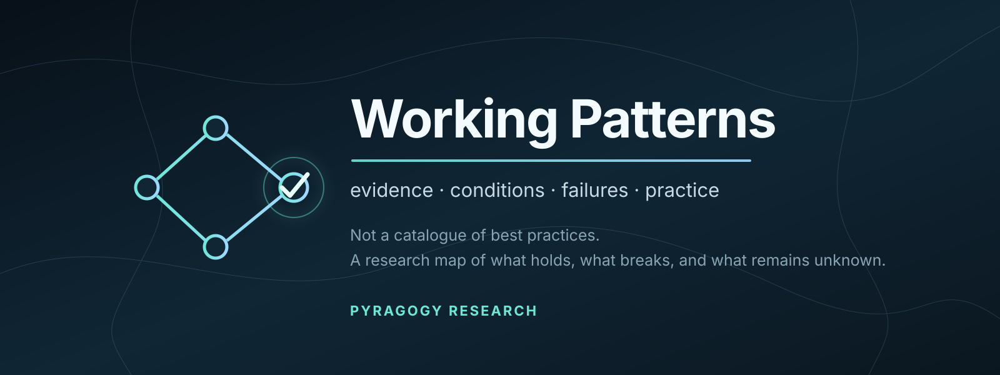

<div align="center">
  
</div>

<p align="center">
  <strong>Evidence-aware organisational patterns: what appears to work, where, why, at what cost — and where it breaks.</strong>
</p>

<p align="center">
  <a href="https://github.com/pyragogy/working-patterns/actions/workflows/validate.yml"></a>
  
  
  
</p>

<p align="center">
  <a href="METHODOLOGY.md">Method</a> ·
  <a href="research/research-map-0.2.md">Research Map 0.2</a> ·
  <a href="research/SEARCH_LOG.md">Search Log</a> ·
  <a href="docs/AI_RESEARCH_AGENDA.md">AI Research Questions</a> ·
  <a href="docs/ROADMAP.md">Roadmap</a> ·
  <a href="CONTRIBUTING.md">Contribute evidence</a>
</p>

---

## The question

> **Which organisational patterns appear to work, for which problems, under which conditions, according to what evidence — and where do they stop working?**

Working Patterns studies recurring organisational practices used by teams, cooperatives, open-source projects, communities, networks, and other groups trying to work together.

It is **not a catalogue of universal best practices**.

The project treats a pattern as an investigable intervention rather than a slogan:

```text
problem → intervention → implementation → outcome → evidence → conditions
```

A source may document a protocol, observe a practice, compare alternatives, measure an outcome, or merely make a mechanism plausible. Those are different epistemic jobs and the corpus keeps them different.

---

## What makes this different

Working Patterns is designed around five separations:

| Do not collapse | Why it matters |
|---|---|
| **claim ≠ source** | A source can support one proposition and complicate another. |
| **problem evidence ≠ solution evidence** | Showing that invisible labour exists does not prove that rotation fixes it. |
| **adoption ≠ implementation** | Calling a meeting “consensus” or “retrospective” does not establish what happened. |
| **one outcome ≠ overall success** | Participation can rise while moderation cost or power concentration also rises. |
| **convergence ≠ independent replication** | Multiple authors, agents, or frameworks may share the same data, cases, or lineage. |

The project therefore refuses a single “evidence score” or “confidence score” for a pattern.

The useful answer is often conditional:

> **This component appears supported for this outcome in these contexts; this part remains unknown; this counterevidence changes the boundary.**

---

## Current corpus

The first two research cycles were completed on **14 September 2026**.

**Research Map 0.1** mapped 19 research families and extracted Richard D. Bartlett's *Patterns for Decentralised Organising* as Seed Corpus 001.

**Research Map 0.2** took seven candidate families through a deeper evidence cycle.

| ID | Pattern family | Current assessment |
|---|---|---|
| `WP-C001` | Explicit norms and enforcement | `documented` · `narrow-context` · context-limited |
| `WP-C002` | Structured retrospectives / debriefs with follow-up | debrief core **provisionally** `corroborated`; key synthesis support remains abstract-level pending full-text methods audit and deduplication; full package `documented` |
| `WP-C003` | Explicit distribution of care work | `documented` · `narrow-context` |
| `WP-C004` | Informal power and mandates | `documented` · `narrow-context` |
| `WP-C005` | Consensus / consent / lazy consensus | `documented` · comparative evidence insufficient |
| `WP-C006` | Asynchronous decision-making | `documented` · `narrow-context` · context-limited |
| `WP-C007` | Conflict and dissent | broad formulation `contested` |

The machine-readable v0.1 corpus currently contains:

- **7** human organisational pattern families;
- **32** enumerated claim records;
- **11** case / case-cluster records;
- **21** seed/source records;
- **15** study/synthesis records;
- **8** explicit genealogy/dependence relations;
- **12** separate Pyragogy AI research candidates.

These counts are inventory, **not evidence strength**. A claim-count discrepancy in the original Research Map 0.2 is preserved as an explicit [`erratum`](research/ERRATA.md) rather than repaired by inventing a record.

### Important methodological limits

The epistemic scaffold is currently stronger than the empirical coverage.

- Cycles 0.1/0.2 were exploratory evidence mapping, **not a systematic review**.
- The historical search process was not recorded with complete query strings, database-by-database result counts, dual screening, and exclusion logs. This gap is now explicit in [`research/SEARCH_LOG.md`](research/SEARCH_LOG.md); it will not be retroactively fabricated.
- Most coding has been performed in a single-researcher, AI-assisted workflow. A minimal independent recoding procedure is specified in [`docs/SECOND_READER_PROTOCOL.md`](docs/SECOND_READER_PROTOCOL.md), but no dual-review claim is made until that work actually occurs.
- The corpus remains culturally and linguistically narrow relative to the ambition of the project; low-resource, multilingual, non-Western, cooperative, mutual-aid, and exit/dissolution contexts remain priority gaps.

---

## Evidence relations

Evidence is attached to a **bounded claim** through one of four relations:

```text
supports
complicates
contradicts
context-only
```

For example, evidence that open communities can concentrate authority is highly relevant to the **problem** of informal power; it is not automatically evidence that rotating roles will solve it.

See [`data/claims/claims.json`](data/claims/claims.json).

---

## Pattern maturity

Human pattern records currently use:

```text
candidate → documented → corroborated
                     ↘ contested → revised → retired
```

This is a research lifecycle, not a quality ladder.

`documented` means the intervention is described well enough to investigate. It does **not** mean effective.

`corroborated` must also be read with its verification state and scope. In the current corpus, `WP-C002-A` is explicitly **provisional** because its strongest synthesis-level support has not yet completed the full-text methods audit required for further promotion.

Evidence breadth is tracked separately:

- `narrow-context`
- `multi-context`
- `cross-domain`

---

## Pyragogy AI research questions — not evaluated Working Patterns

> **⚠️ Status: hypothesis generation only.** The 12 `WP-AI*` records have not completed an evidence cycle. They must not be treated as validated patterns, recommendations, or evidence that Pyragogy's hypotheses are correct.

Working Patterns also asks a second question:

> **Which candidate interventions might help humans and AI systems work together without hiding authority, evidence, dissent, cost, or failure — and what evidence would falsify them?**

The initial research questions include:

- **Friction Before Delegation**
- **Provenance Before Persuasion**
- **Bounded AI Mandate**
- **Reversible Automation**
- **Escalation Ladder for Autonomy**
- **Preserve Dissent Through Synthesis**
- **Separate Observation, Interpretation, and Recommendation**
- **Scoped Memory**
- **Handoff With Epistemic Debt**
- **Independence Before Multi-Agent Consensus**
- **Name the Accountable Human Authority**
- **Close the AI Advice Loop**

They are deliberately pinned to:

```text
pattern_maturity: candidate
evidence_status: research-agenda
```

The analogies to human organisational patterns are **hypotheses to test**, not evidence of shared mechanism. For example, human dissent and information loss during LLM summarisation may resemble one another functionally while operating through different mechanisms.

Pyragogy is the reason to investigate these questions — **not evidence that they work**.

Read [`docs/AI_RESEARCH_AGENDA.md`](docs/AI_RESEARCH_AGENDA.md) or inspect [`data/ai-patterns/candidates.json`](data/ai-patterns/candidates.json).

---

## A future advisor should argue, not prescribe

A future MCP / organisational advisor should not answer:

> “Use async decision-making.”

It should be able to respond to something like:

> “We are a remote team of 14 people. Synchronous decisions exclude several members. Which patterns are relevant, what evidence supports them, under which conditions, what alternatives exist, and what could go wrong?”

Before recommending even a local experiment, it should ask about decision type, reversibility, time pressure, excluded members, language/access, reading time, present authority, and objection handling.

Then it should expose:

```text
candidate patterns
+ evidence
+ counterevidence
+ boundary conditions
+ alternatives
+ costs
+ failure modes
+ unknowns
```

This is the intended path:

```text
open research corpus
        ↓
handbook / workbook / cards
        ↓
evidence-aware MCP / advisor
        ↓
local experiments that can feed evidence back into the corpus
```

See the [`roadmap`](docs/ROADMAP.md) and future [`query contract`](docs/QUERY_CONTRACT.md).

---

## Research maps

The narrative layer explains why the structured corpus looks the way it does:

- [`Research Map 0.1`](research/research-map-0.1.md) — field reconnaissance, seed extraction, source families, initial taxonomy and gaps;
- [`Research Map 0.2`](research/research-map-0.2.md) — seven deep dives, evidence/counterevidence, cases, genealogy, costs, boundary conditions, and MCP-readiness assessment;
- [`Search Log`](research/SEARCH_LOG.md) — explicit retrospective search limitations plus the prospective search record from cycle 0.3 onward;
- [`Research provenance`](research/PROVENANCE.md) — hashes and normalisation rules for the original research outputs;
- [`Errata`](research/ERRATA.md) — discrepancies preserved rather than silently rewritten.

Historical maps are snapshots. New evidence should revise the live corpus and create a new research cycle rather than rewriting the past.

---

## Repository structure

```text
working-patterns/
├── README.md
├── METHODOLOGY.md
├── CONTRIBUTING.md
├── LICENSING.md
├── VERSIONING.md
├── CHANGELOG.md
├── research/
│   ├── PROVENANCE.md
│   ├── ERRATA.md
│   ├── SEARCH_LOG.md
│   ├── research-map-0.1.md
│   └── research-map-0.2.md
├── data/
│   ├── manifest.json
│   ├── patterns/patterns.json
│   ├── claims/claims.json
│   ├── cases/cases.json
│   ├── sources/sources.json
│   ├── studies/studies.json
│   ├── genealogy/relations.json
│   ├── ai-patterns/candidates.json
│   └── schema/v0.1/
├── docs/
│   ├── AI_RESEARCH_AGENDA.md
│   ├── DECISION_LOG.md
│   ├── FIELD_GUIDE_TEMPLATE.md
│   ├── GOVERNANCE.md
│   ├── GLOSSARY.md
│   ├── QUERY_CONTRACT.md
│   ├── SECOND_READER_PROTOCOL.md
│   └── ROADMAP.md
├── examples/
│   └── remote-team-async.md
├── scripts/
│   ├── query.py
│   └── validate_corpus.py
└── .github/
    ├── ISSUE_TEMPLATE/
    └── workflows/validate.yml
```

---

## Integrity gate

The repository contains a zero-dependency validator:

```bash
python scripts/validate_corpus.py
```

It checks, among other things:

- stable/unique IDs;
- claim → pattern/component references;
- claim → source/case references;
- study → source/case references;
- genealogy dependencies;
- manifest counts;
- canonical evidence relations;
- pattern maturity/scope/mechanism enums;
- source-less claims explicitly marked as synthesis;
- AI seed patterns remaining `candidate / research-agenda`;
- absence of prohibited aggregate evidence/confidence scores.

GitHub Actions runs the gate on pushes and pull requests to `main`.

The validator can detect structural/epistemic inconsistencies. It cannot determine whether a scientific claim is true.

For lightweight inspection:

```bash
python scripts/query.py list
python scripts/query.py pattern WP-C006
python scripts/query.py ai WP-AI006
```

---

## Contribute friction

Useful contributions are not endorsements. They include:

- a source that directly supports one intervention component;
- a failed or abandoned implementation;
- a person/group exit case;
- counterevidence;
- a better locator;
- evidence of shared datasets or shared genealogy;
- a licence correction;
- a boundary condition;
- an alternative intervention;
- evidence that declared practice diverged from actual implementation;
- an AI candidate failure.

Use the issue forms or read [`CONTRIBUTING.md`](CONTRIBUTING.md).

> **“This conclusion is unsupported” is a successful research contribution if the evidence shows it.**

---

## Licensing

Working Patterns studies sources with heterogeneous rights: CC0, CC BY, CC BY-SA, CC BY-NC, Apache-licensed material, and conventional or unresolved copyright.

The project therefore separates:

1. research notes and structured facts;
2. quotations;
3. reusable licensed material;
4. original Working Patterns prose.

There is deliberately no assumption that everything cited here can be republished commercially.

See [`LICENSING.md`](LICENSING.md).

---

## Relationship to UnPeeragogy

Working Patterns and [UnPeeragogy](https://github.com/pyragogy/UnPeeragogy) ask complementary questions:

```text
UnPeeragogy
pattern/theory → friction → counterevidence → revision

Working Patterns
problem → intervention → implementation → evidence → conditions → alternatives
```

Both belong to the Pyragogy research ecosystem: **AI that can expose friction and uncertainty, not merely produce agreement.**

---

## Research status

Working Patterns is currently an **exploratory evidence-mapping project**.

It is not yet:

- a completed systematic review;
- a validated catalogue of best practices;
- a causal recommendation engine;
- an autonomous organisational advisor.

That limitation is part of the product specification, not something to hide.

> **Unknown does not mean zero, absent, ineffective, or disproven.**

---

<p align="center">
  <strong>A Pyragogy research project.</strong><br/>
  <em>Use it. Test it. Contradict it. Leave the evidence better than you found it.</em>
</p>
